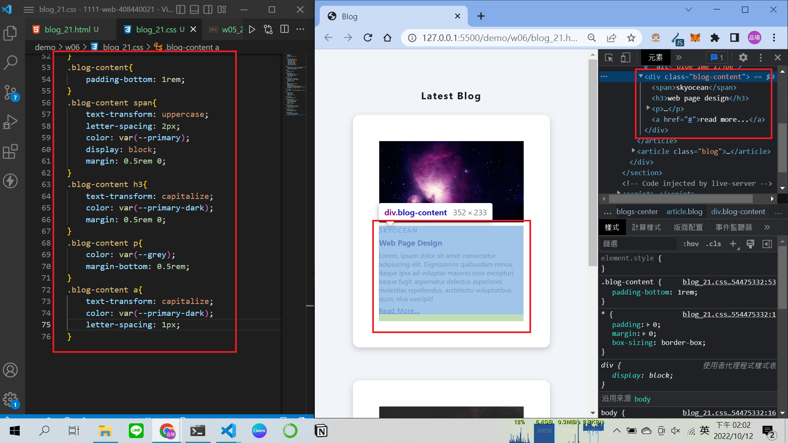
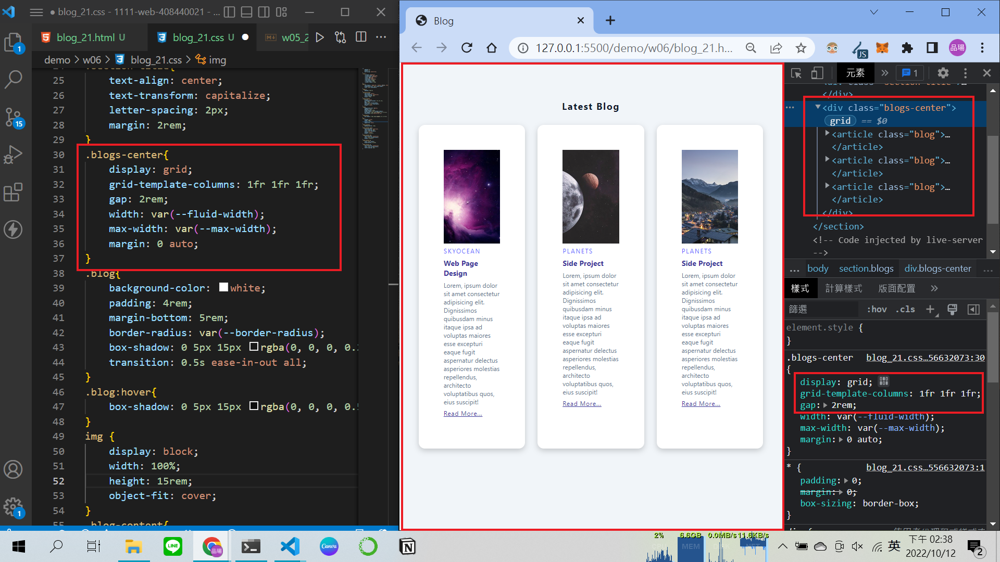
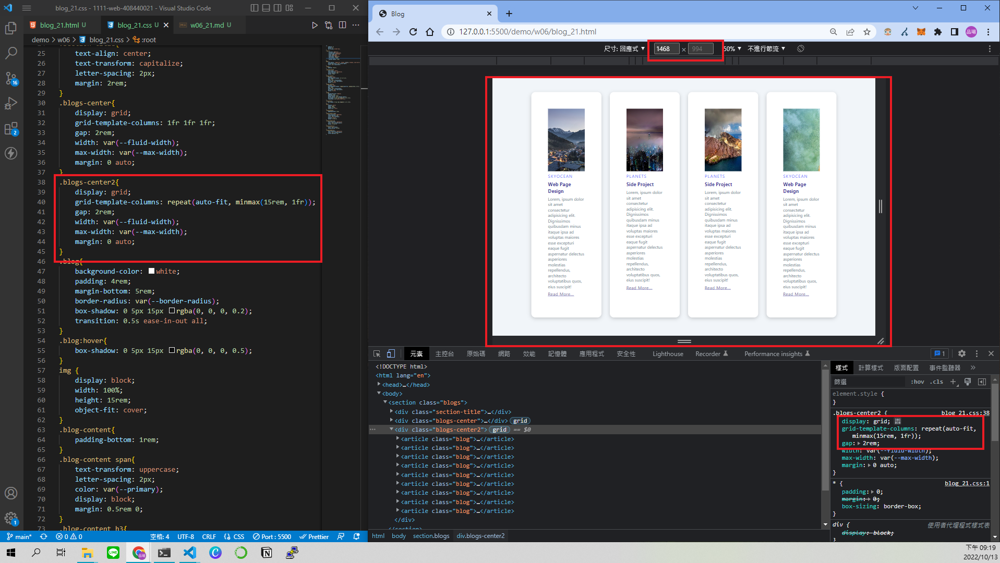
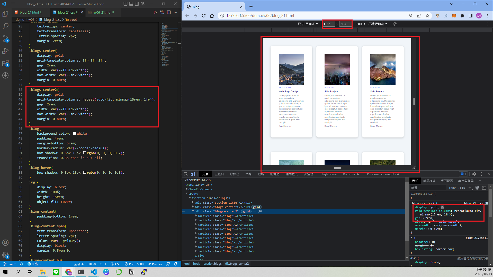
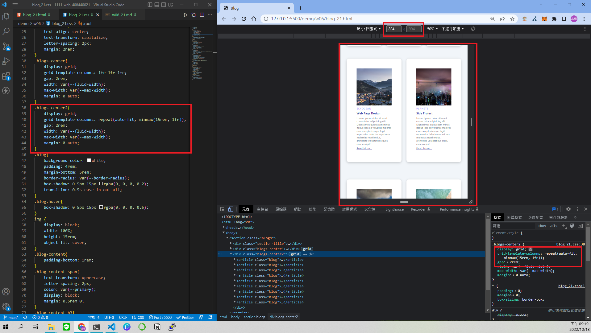
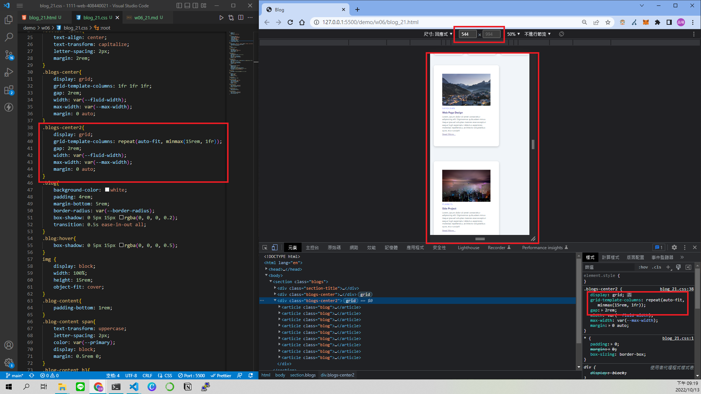
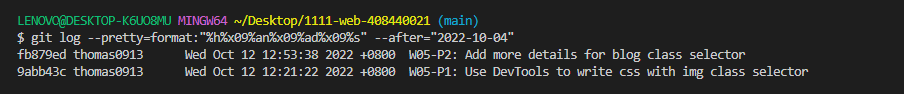

### Github URL

[click me to hyperlink github repo](https://github.com/thomas0913/1111-web-408440021)

### Vercel URL

[click me to hyperlink vercel project](https://1111-web-408440021.vercel.app/)

### W06-P1: Add blog content with css



### W06-P2: Use css grid to show 3 blogs



### W06-P3: Use css grid (minmax) to show 9 blogs









### W06-logs: W6 all logs



```
fb879ed thomas0913      Wed Oct 12 12:53:38 2022 +0800  W05-P2: Add more details for blog class selector
9abb43c thomas0913      Wed Oct 12 12:21:22 2022 +0800  W05-P1: Use DevTools to write css with img class selector
```