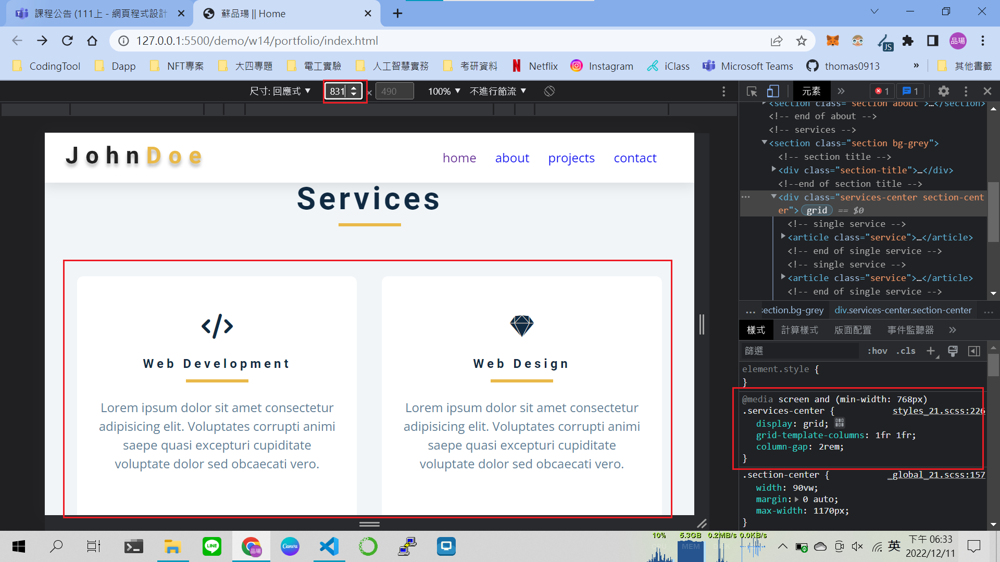
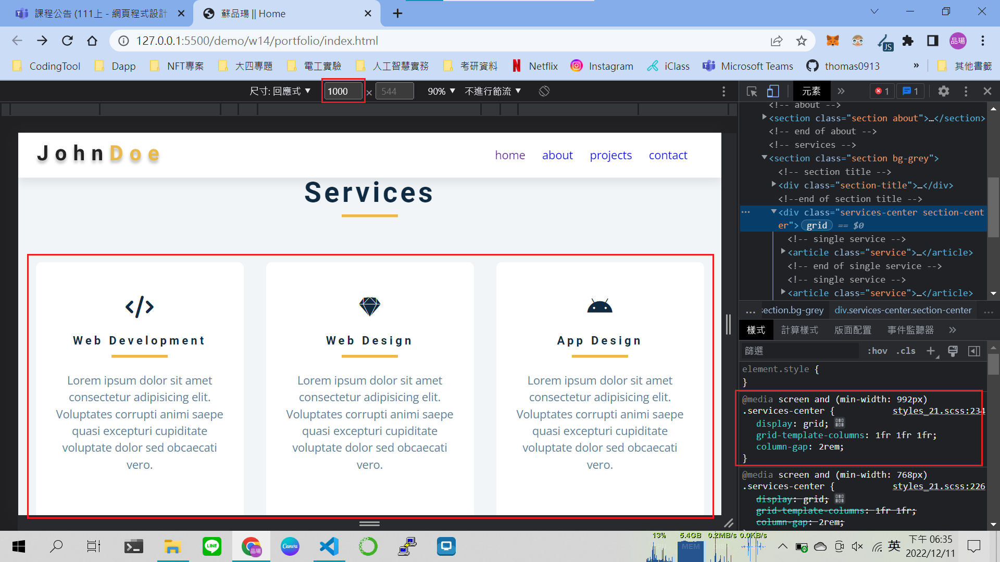
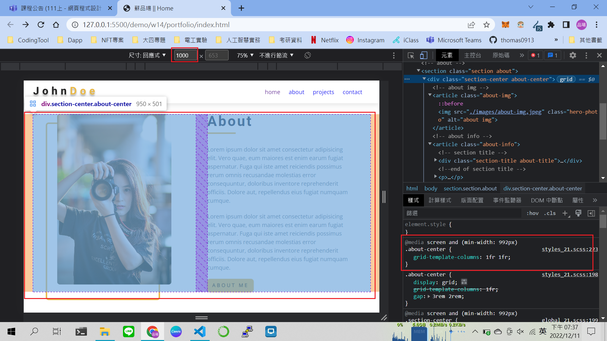

## Github & Vercel URL

[click me to hyperlink github repo](https://github.com/thomas0913/1111-web-408440021)

[click me to hyperlink vercel project](https://1111-web-408440021.vercel.app/)

### W12-P1: create nav btn, nav links display none


### W12-P2: nav-btn and close-btn works


### w13-P1: show fixed navbar with js and css


### w13-P2: hero-img in section hero


### w14-P1: file structures for final project


### w14-P2: social icons using global css, and custom css


### w14-P3: Services section with responsive design with phone, pad and desktop computer






### w14-P4: finish About section with responsive design with phone, and desktop computer




### W14-logs: W14 all logs


```
$ git log --pretty=format:"%h%x09%an%x09%ad%x09%s" --after="2022-12-06"
f6dbf6f thomas0913      Sun Dec 11 19:40:55 2022 +0800  w14-P4: finish About section with responsive design with phone, and desktop computer
e306f32 thomas0913      Sun Dec 11 18:38:47 2022 +0800  w14-P3: Services section with responsive design with phone, pad and desktop computer 
1d538a8 thomas0913      Sun Dec 11 17:36:51 2022 +0800  w14-P2: social icons using global css, and custom css
62e6521 thomas0913      Sun Dec 11 16:58:00 2022 +0800  w14-P1: file structures for final project
ff773b9 thomas0913      Tue Dec 6 23:20:55 2022 +0800   w13-P2: hero-img in section hero
25c849b thomas0913      Tue Dec 6 20:31:36 2022 +0800   w13-P1: show fixed navbar with js and css
```
