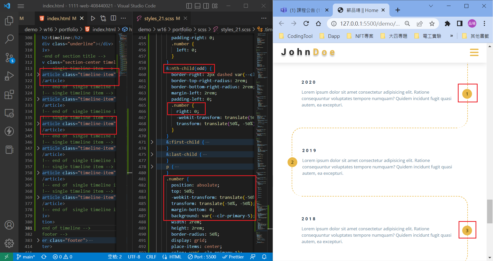
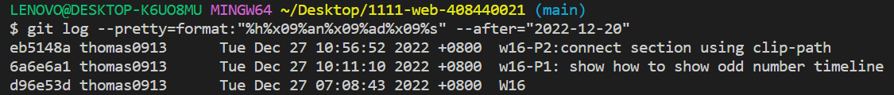

## Github & Vercel URL

[click me to hyperlink github repo](https://github.com/thomas0913/1111-web-408440021)

[click me to hyperlink vercel project](https://1111-web-408440021.vercel.app/)

### w16-P1: show how to show odd number timeline



### w16-P2:connect section using clip-path


### w16-logs: W16 all logs



```bash
$ git log --pretty=format:"%h%x09%an%x09%ad%x09%s" --after="2022-12-20"
eb5148a thomas0913      Tue Dec 27 10:56:52 2022 +0800  w16-P2:connect section using clip-path
6a6e6a1 thomas0913      Tue Dec 27 10:11:10 2022 +0800  w16-P1: show how to show odd number timeline
d96e53d thomas0913      Tue Dec 27 07:08:43 2022 +0800  W16
```