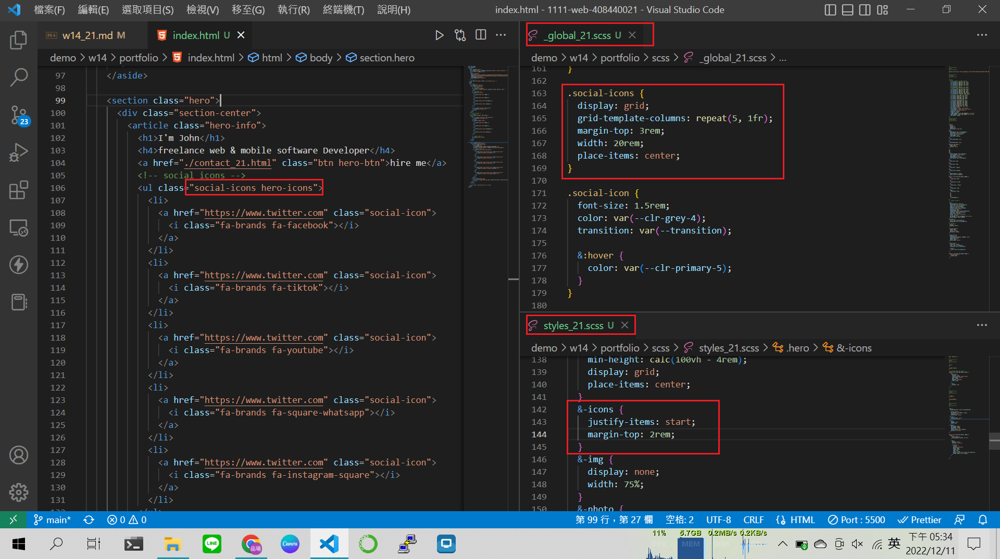
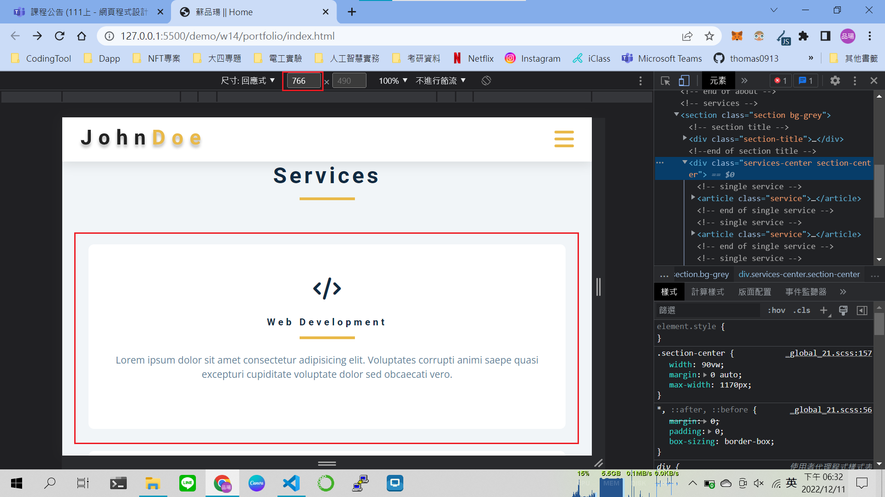

## Github & Vercel URL

[click me to hyperlink github repo](https://github.com/thomas0913/1111-web-408440021)

[click me to hyperlink vercel project](https://1111-web-408440021.vercel.app/)

### w14-P1: file structures for final project


### w14-P2: social icons using global css, and custom css



### w14-P3: Services section with responsive design with phone, pad and desktop computer




### w14-P4: finish About section with responsive design with phone, and desktop computer


### W14-logs: W14 all logs


```
$ git log --pretty=format:"%h%x09%an%x09%ad%x09%s" --after="2022-12-06"
f6dbf6f thomas0913      Sun Dec 11 19:40:55 2022 +0800  w14-P4: finish About section with responsive design with phone, and desktop computer
e306f32 thomas0913      Sun Dec 11 18:38:47 2022 +0800  w14-P3: Services section with responsive design with phone, pad and desktop computer 
1d538a8 thomas0913      Sun Dec 11 17:36:51 2022 +0800  w14-P2: social icons using global css, and custom css
62e6521 thomas0913      Sun Dec 11 16:58:00 2022 +0800  w14-P1: file structures for final project
ff773b9 thomas0913      Tue Dec 6 23:20:55 2022 +0800   w13-P2: hero-img in section hero
25c849b thomas0913      Tue Dec 6 20:31:36 2022 +0800   w13-P1: show fixed navbar with js and css
```

### w15-P1:nav link to about page with navbar and footer


### w15-P2: Latest works using grid-template-areas


### W15-logs: W15 all logs


```bash
$ git log --pretty=format:"%h%x09%an%x09%ad%x09%s" --after="2022-12-13"
a5b0514 thomas0913      Mon Dec 26 17:09:19 2022 +0800  w15-P2: Latest works using grid-template-areas
bc4b9f4 thomas0913      Mon Dec 26 17:03:16 2022 +0800  w15-P1:nav link to about page with navbar and footer
```

### w16-P1: show how to show odd number timeline


### w16-P2:connect section using clip-path


### w16-logs: W16 all logs


```bash
$ git log --pretty=format:"%h%x09%an%x09%ad%x09%s" --after="2022-12-20"
eb5148a thomas0913      Tue Dec 27 10:56:52 2022 +0800  w16-P2:connect section using clip-path
6a6e6a1 thomas0913      Tue Dec 27 10:11:10 2022 +0800  w16-P1: show how to show odd number timeline
d96e53d thomas0913      Tue Dec 27 07:08:43 2022 +0800  W16
```

### w11~w17-logs

- week 11 github logs


- week 12 github logs


- week 13 github logs


- week 14 github logs


- week 15 github logs


- week 16 github logs

