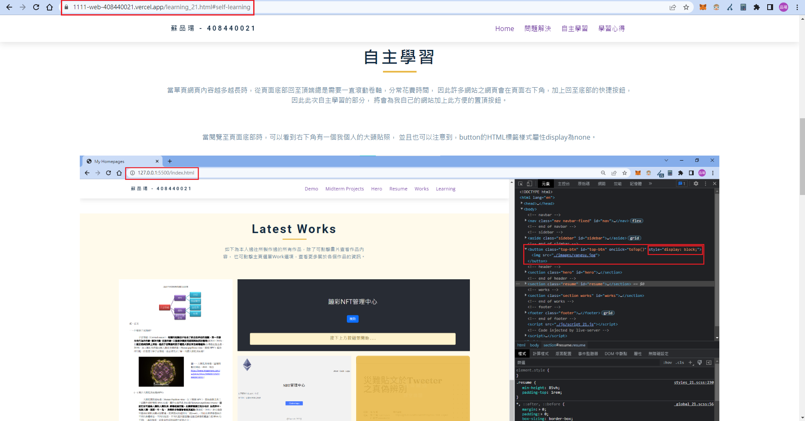

### Github & Vercel URL

[Github URL](https://github.com/thomas0913/1111-web-408440021)

[Vercel URL](https://1111-web-408440021.vercel.app/)

[Final Project Github URL](https://github.com/thomas0913/1111-web-408440021)


[Final Project Vercel URL](https://1111-web-408440021.vercel.app/)


### Final-P1: Add the hyperlink to my demo

- [Demo Github URL](https://github.com/thomas0913/1111-web-408440021/blob/main/demo_21.html)


- [Demo Verecel URL](https://1111-web-408440021.vercel.app/demo_21.html)


### Final-P1: Add the hyperlink to my learning

- [learning Github URL](https://github.com/thomas0913/1111-web-408440021/blob/main/learning_21.html)


- [learning Verecel URL](https://1111-web-408440021.vercel.app/learning_21.html)

    <br/>1. 問題解決

    

    <br/>2. 自主學習

    

    <br/>3. 學習心得

    

### Final-logs: all logs for final project


```bash

```