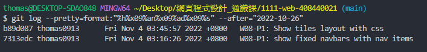

### Github & Vercel URL

[Github URL](https://github.com/thomas0913/1111-web-408440021)

[Vercel URL](https://1111-web-408440021.vercel.app/)

[Midterm Project Github URL](https://github.com/thomas0913/1111-web-408440021/tree/main/project/midterm)


[Midterm Project Vercel URL](https://1111-web-408440021.vercel.app/)


### Md file structure


### Midterm-P1: Add the hyperlink to my demo

- [Week 8 md Github URL](https://github.com/thomas0913/1111-web-408440021/blob/main/demo_21.html)


- [Week 9 md Github URL](https://1111-web-408440021.vercel.app/demo_21.html)


### Midterm-P2: Add the hyperlink to my works

- [Works Github URL](https://github.com/thomas0913/1111-web-408440021/blob/main/project/midterm/mid-project_21.html)


- [Works Vercel URL](https://1111-web-408440021.vercel.app/project/midterm/mid-project_21.html)


### Midterm-P3: Add the hyperlink to my resume

- [Resume Github URL](https://github.com/thomas0913/1111-web-408440021/blob/main/project/midterm/resume_21.html)


- [Resume Vercel URL](https://1111-web-408440021.vercel.app/project/midterm/resume_21.html)


### Midterm-P4: Add the hyperlink to my learning

- [Learning Github URL](https://github.com/thomas0913/1111-web-408440021/blob/main/project/midterm/learning_21.html)


- [Learning Vercel URL](https://1111-web-408440021.vercel.app/project/midterm/learning_21.html)

1. 問題解決

    

    

2. 自主學習

    

    

3. 學習心得

    

### Midterm-logs: all logs for midterm project



```
$ git log --pretty=format:"%h%x09%an%x09%ad%x09%s" --after="2022-10-25"

b89d087 thomas0913      Fri Nov 4 03:45:57 2022 +0800   W08-P1: Show tiles layout with css
7313edc thomas0913      Fri Nov 4 03:16:26 2022 +0800   W08-P1: show fixed navbars with nav items
```