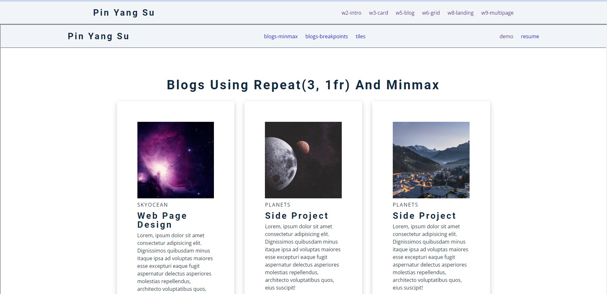
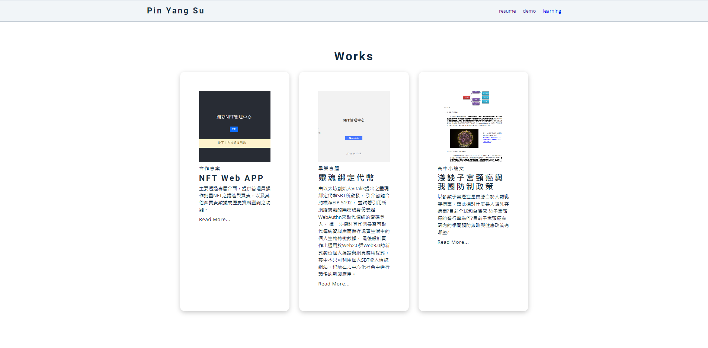
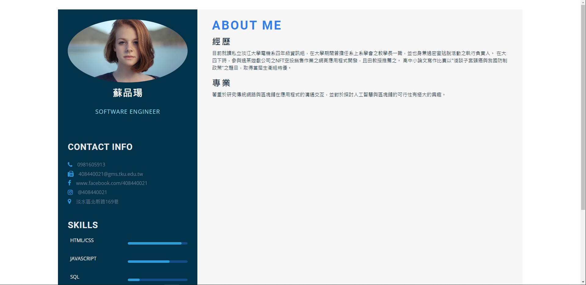
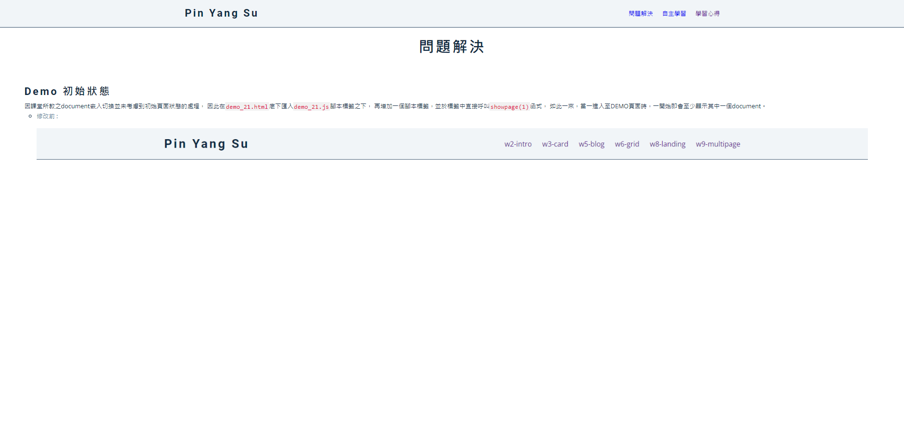
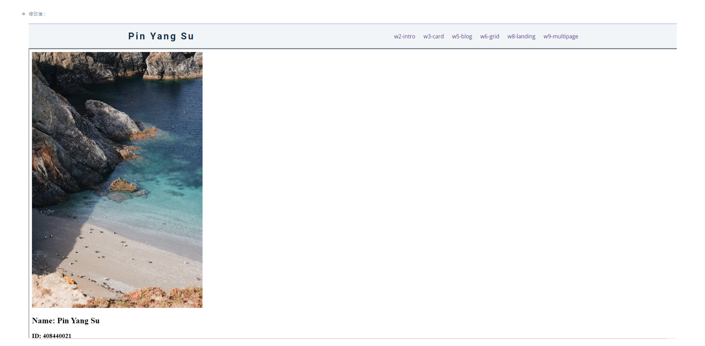
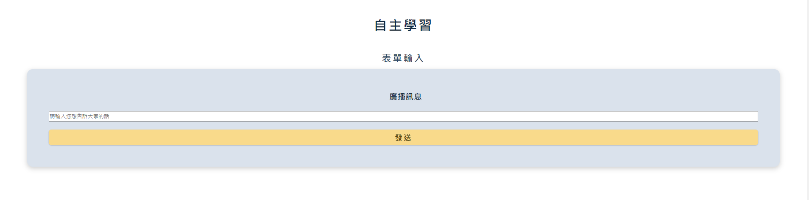
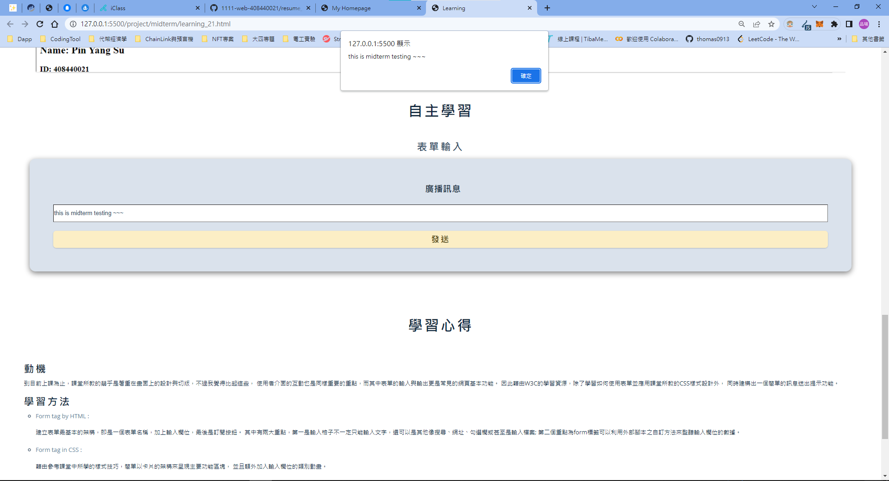
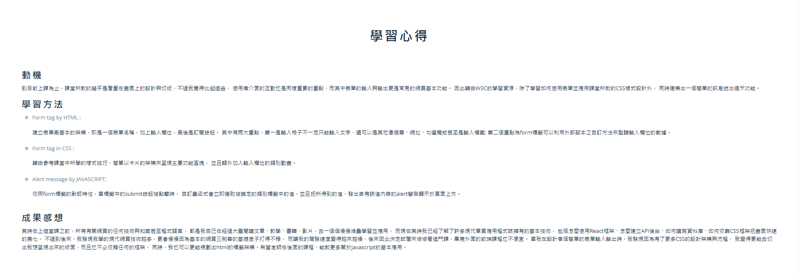

### Midterm-P1: Add the hyperlink to my demo

- [The hyperlink to my demo on github repo](https://github.com/thomas0913/1111-web-408440021/blob/main/demo_21.html)

- [The hyperlink to my demo on vercel project](https://1111-web-408440021.vercel.app/demo_21.html)

### Midterm-P2: Add the hyperlink to my works

- [The hyperlink to my works on github repo](https://github.com/thomas0913/1111-web-408440021/blob/main/project/midterm/mid-project_21.html)

- [The hyperlink to my works on vercel project](https://1111-web-408440021.vercel.app/project/midterm/mid-project_21.html)

### Midterm-P3: Add the hyperlink to my resume

- [The hyperlink to my resume on github repo](https://github.com/thomas0913/1111-web-408440021/blob/main/project/midterm/resume_21.html)

- [The hyperlink to my resume on vercel project](https://1111-web-408440021.vercel.app/project/midterm/resume_21.html)

### Midterm-P4: Add the hyperlink to my learning

- [The hyperlink to my learning on github repo](https://github.com/thomas0913/1111-web-408440021/blob/main/project/midterm/resume_21.html)

- [The hyperlink to my learning on vercel project](https://1111-web-408440021.vercel.app/project/midterm/resume_21.html)

1. 問題解決

    

    

2. 自主學習

    

    

3. 學習心得

    