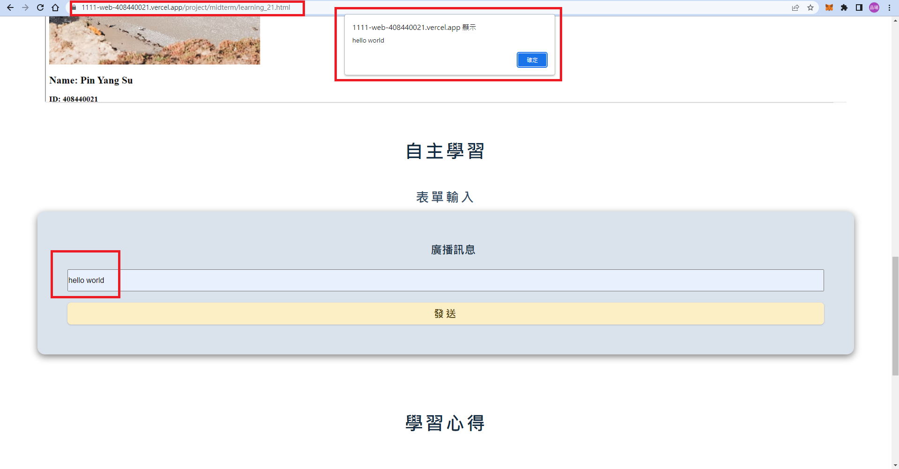

### Github & Vercel URL

[Github URL](https://github.com/thomas0913/1111-web-408440021)

[Vercel URL](https://1111-web-408440021.vercel.app/)

[Midterm Project Github URL](https://github.com/thomas0913/1111-web-408440021/tree/main/project/midterm)


[Midterm Project Vercel URL](https://1111-web-408440021.vercel.app/)


### Md file structure


### Midterm-P1: Add the hyperlink to my demo

- [Week 8 md Github URL](https://github.com/thomas0913/1111-web-408440021/blob/main/demo_21.html)


- [Week 9 md Github URL](https://1111-web-408440021.vercel.app/demo_21.html)


### Midterm-P2: Add the hyperlink to my works

- [Works Github URL](https://github.com/thomas0913/1111-web-408440021/blob/main/project/midterm/mid-project_21.html)


- [Works Vercel URL](https://1111-web-408440021.vercel.app/project/midterm/mid-project_21.html)


### Midterm-P3: Add the hyperlink to my resume

- [Resume Github URL](https://github.com/thomas0913/1111-web-408440021/blob/main/project/midterm/resume_21.html)


- [Resume Vercel URL](https://1111-web-408440021.vercel.app/project/midterm/resume_21.html)


### Midterm-P4: Add the hyperlink to my learning

- [Learning Github URL](https://github.com/thomas0913/1111-web-408440021/blob/main/project/midterm/learning_21.html)


- [Learning Vercel URL](https://1111-web-408440021.vercel.app/project/midterm/learning_21.html)

1. 問題解決

    

    

2. 自主學習

    

    

3. 學習心得

    

### Midterm-logs: all logs for midterm project


```
$ git log --pretty=format:"%h%x09%an%x09%ad%x09%s" --after="2022-11-6"

36fe9ed thomas0913      Sat Nov 12 01:01:50 2022 +0800  Midterm-logs: all logs for midterm project
2ac2569 thomas0913      Sat Nov 12 00:29:27 2022 +0800  add Midterm Project Vercel URL
6f99559 thomas0913      Fri Nov 11 19:22:27 2022 +0800  W10-logs: show all logs of Week 9
55150f6 thomas0913      Fri Nov 11 19:18:43 2022 +0800  Merge branch 'main' of https://github.com/thomas0913/1111-web-408440021
7dd36c2 thomas0913      Fri Nov 11 19:18:16 2022 +0800  W10-P3: show w10_21.md from Github
8ac6c8e 蘇品瑒  Fri Nov 11 19:15:29 2022 +0800  Update w10_21.md
508c713 蘇品瑒  Fri Nov 11 19:14:46 2022 +0800  Update w10_21.md
b4c59ff thomas0913      Fri Nov 11 19:12:44 2022 +0800  W10-P2: show w09-resume from Vercel
0c4d25c thomas0913      Fri Nov 11 19:09:17 2022 +0800  W10-P2: show w09-resume from Vercel
0e3b47b thomas0913      Fri Nov 11 19:04:14 2022 +0800  W10-P1: show w09-resume locally
e6497a2 thomas0913      Thu Nov 10 16:13:13 2022 +0800  Midterm-P4: Add the hyperlink to my learning
f276dc5 thomas0913      Thu Nov 10 16:11:48 2022 +0800  Midterm-P4: Add the hyperlink to my learning
b03803b thomas0913      Thu Nov 10 14:53:46 2022 +0800  ### Midterm-P3: Add the hyperlink to my resume
375b62e thomas0913      Thu Nov 10 14:53:08 2022 +0800  Midterm-P2: Add the hyperlink to my works
9733eaf thomas0913      Thu Nov 10 14:47:22 2022 +0800  Add the hyperlink to my demo
```