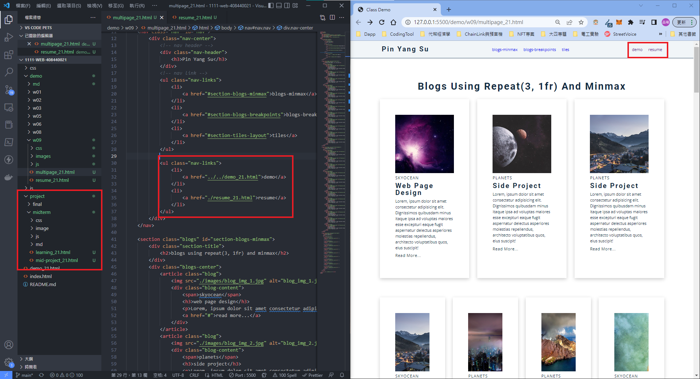
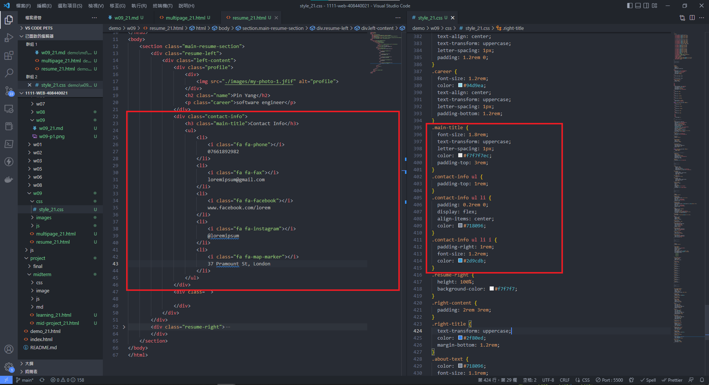
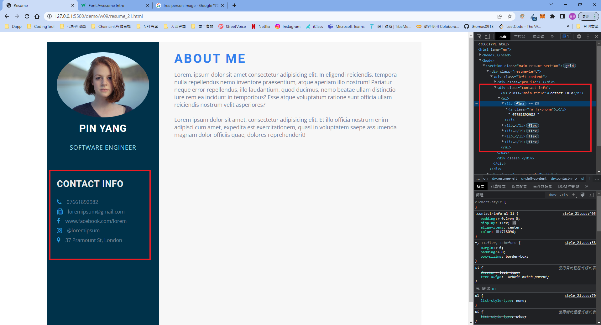
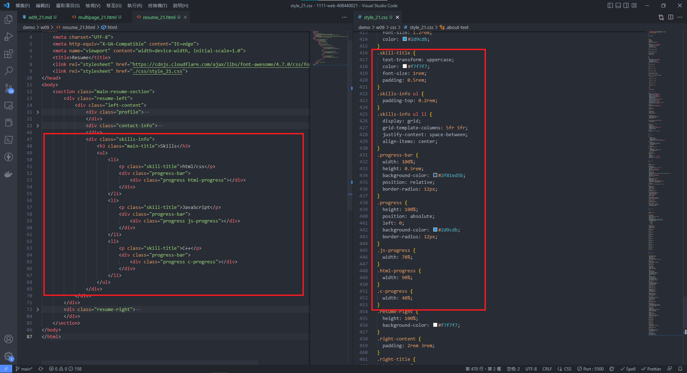
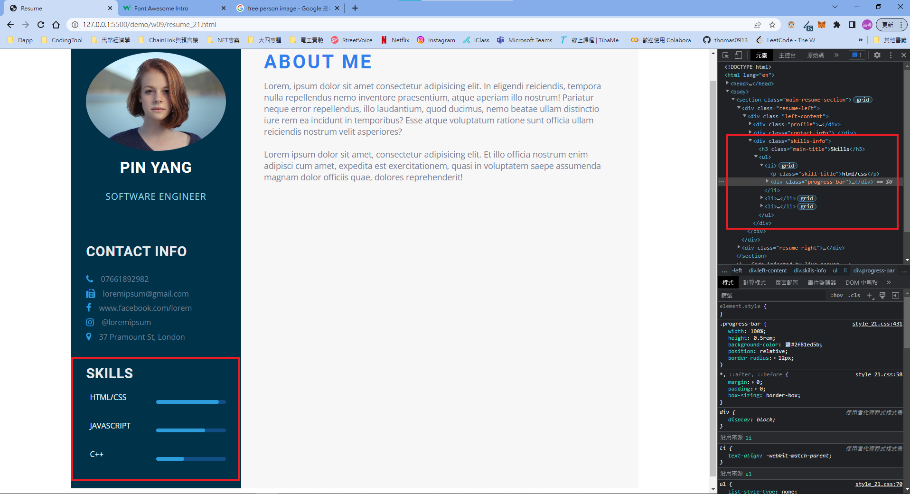
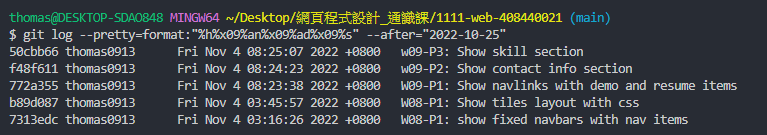

### Github URL

[click me to hyperlink github repo](https://github.com/thomas0913/1111-web-408440021)

### Vercel URL

[click me to hyperlink vercel project](https://1111-web-408440021.vercel.app/)

### W09-P1: Show navlinks with demo and resume items


 
### w09-P2: Show contact info section





### w09-P3: Show skill section 





### W09-logs: W9 all logs



```
$ git log --pretty=format:"%h%x09%an%x09%ad%x09%s" --after="2022-10-25"

50cbb66 thomas0913      Fri Nov 4 08:25:07 2022 +0800   w09-P3: Show skill section
f48f611 thomas0913      Fri Nov 4 08:24:23 2022 +0800   w09-P2: Show contact info section
772a355 thomas0913      Fri Nov 4 08:23:38 2022 +0800   W09-P1: Show navlinks with demo and resume items
b89d087 thomas0913      Fri Nov 4 03:45:57 2022 +0800   W08-P1: Show tiles layout with css
7313edc thomas0913      Fri Nov 4 03:16:26 2022 +0800   W08-P1: show fixed navbars with nav items
```